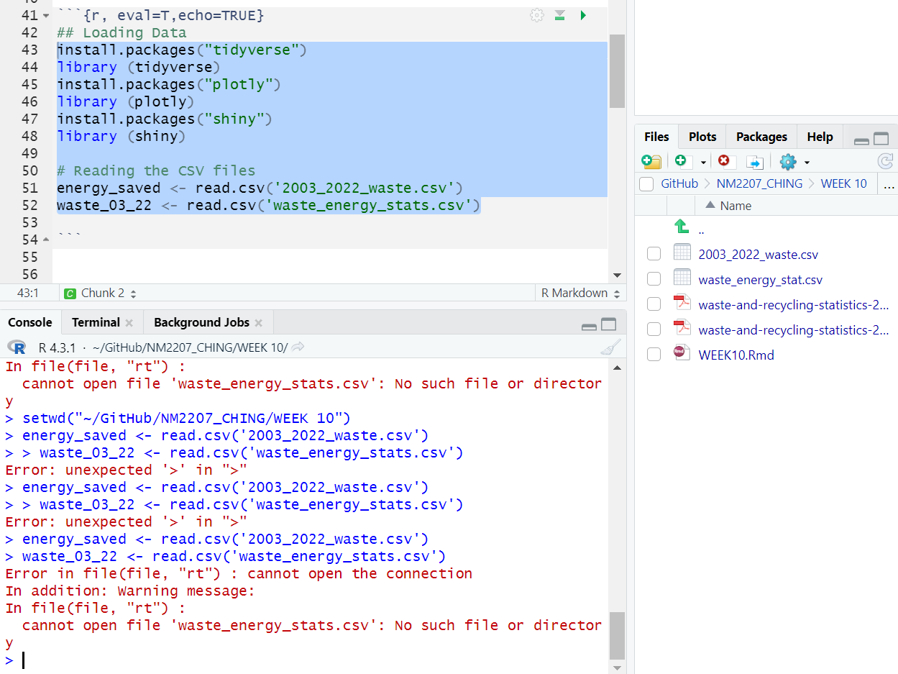
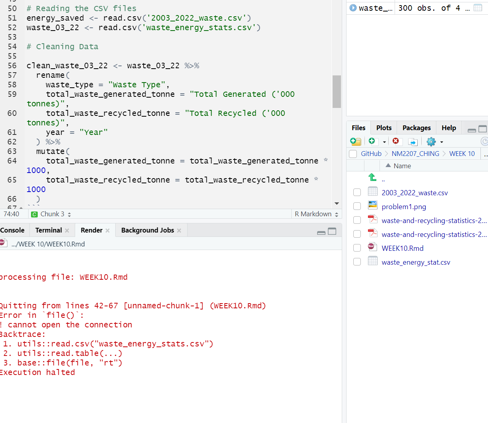
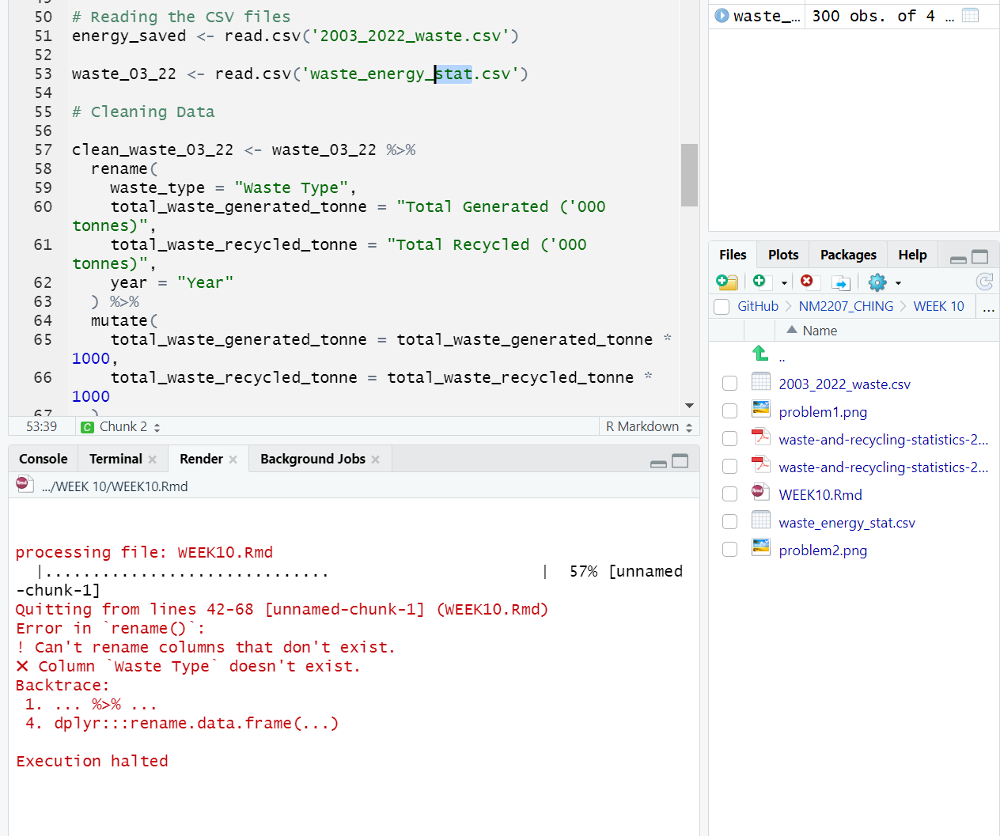
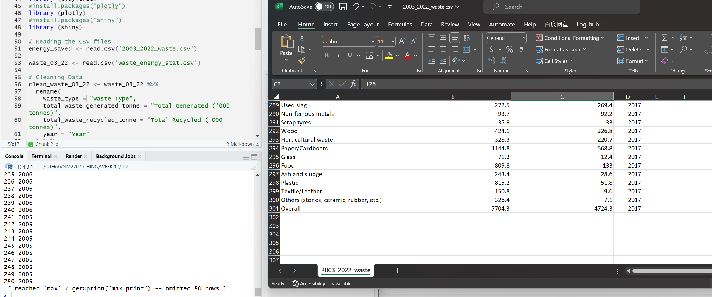

```{r setup, include=FALSE}
knitr::opts_chunk$set(echo = TRUE)
```


Week 9 

    (1) What is the topic that you have finalized? (Answer in 1 or 2 sentences)
        Food Waste Data Analysis
    
    (2) What are the data sources that you have curated so far? (Answer 1 or 2 sentences).
        Recycling statistics per type of waste for 2018-2022
        Source: https://www.nea.gov.sg/our-services/waste-management/waste-statistics-and-overall-recycling
        
        
(Continuation) Week 10

    (1) What is the question that you are going to answer? (Answer: One sentence that ends with a question mark that could act like the title of your data story)
    
Learn how much Singapore is saving energy per years by recycling plastics, paper, glass, ferrous and non-ferrous metal.
    
    (2) Why is this an important question? (Answer: 3 sentences, each of which has some evidence, e.g., “According to the United Nations...” to justify why the question you have chosen is important)
        
In Singapore's quest to achieve zero-waste status, the looming challenge of increased waste disposal.

Coupled with Semakau Landfill's impending limit by 2035, necessitates urgent action. 

The city-state, facing a shortage of land for waste facilities, responds with a unique strategy—inspiring citizens through the revelation of yearly energy savings from collective recycling efforts.
        
    (3) Which rows and columns of the dataset will be used to answer this question? (Answer: Actual names of the variables in the dataset that you plan to use).

I will be using Recycling statistics to calculate energy saved every year from 2003 to 2022 based on 6 waste types: plastics, paper, glass, ferrous, non-ferrous metal and food.


#Problem Encounter 1
```{r}

```

Overcome: by typing separate lines instead of just throwing both at the same time.

#Problem Encounter 2
```{r}

```
Overcome: by typing "waste_energy_stat.csv" instead of "waste_energy_stat(s).csv" --> careless typing

#Problem Encounter 3
```{r}

```
Overcome: Confirm column names mentioned in the 'rename' and 'mutate' function exist in the CSV. They are also case-sensitive, so make sure there are no typos.

#Problem Encounter 4
```{r}

```
Overcome: Rearrange the data


Overview of the Introduction of the webpage:
Learn how much Singapore is saving energy per years by recycling plastics, paper, glass, ferrous and non-ferrous metal.

## Introduction of Narrative 
In the heart of Singapore's bustling landscape, a groundbreaking initiative aims to turn the tide on the nation's mounting waste crisis. With the looming threat of Semakau Landfill reaching its limit by 2035 and a scarcity of land for new waste facilities, the urgency to address this issue has never been more apparent.

As the nation confronts this pressing challenge, a unique strategy unfolds—one that seeks to inspire citizens by revealing the potential energy savings derived from combined recycling efforts. The journey begins with a meticulous project of data cleansing and preparation, focusing on the Singapore NEA Energy Savings dataset (https://www.nea.gov.sg/our-services/waste-management/waste-statistics-and-overall-recycling), which sheds light on total garbage collection and recycling rates. However, the complexity deepens with the diversity in material names from various sources.

To bring the narrative up-to-date, the latest developments are seamlessly integrated, incorporating the 2022 data from waste statistics and overall recycling provided by the National Environment Agency. This ensures a comprehensive and current statistical analysis as the nation strives for a zero-waste future.

The quest for understanding extends beyond borders, drawing insights from Greentumble to gauge the energy production potential of recycling efforts (https://greentumble.com/how-does-recycling-save-energy/). The spotlight narrows onto five key waste types—plastics, paper, glass, ferrous, and non-ferrous metals—forming the cornerstone for calculating annual energy savings from 2003 to 2022. The hope is to propel Singapore toward a future where waste becomes not a problem but a source of renewed energy.

Amidst this environmental pursuit, the narrative weaves in elements of Singapore's unique relationship with food—a nation touted as a food paradise. The complexities of food security and waste management come to the forefront, challenging the conventional notion of waste. The thesis proposes a transformative approach to food waste management by harnessing it as a resource, exploring alternative architectural typologies for decentralized food waste-to-energy production in local neighborhoods.

This proposition not only aims to support closed-loop food systems but also challenges societal perceptions of "waste". This project reflects a holistic inquiry into the intricate relationships between food waste, technology, environment, culture, and society. It calls for a rethink of current waste management practices, emphasizing the potential of waste as a resource that can be repurposed, recycled, and given a second life.

In a city where waste is often out of sight, this narrative brings it to the forefront, proclaiming that not recycling waste is a missed opportunity. With an insatiable appetite for consumption, Singapore must take action to transform waste into a valuable resource, creating a sustainable future where the city's vibrancy is not overshadowed by the looming shadow of excess waste.


